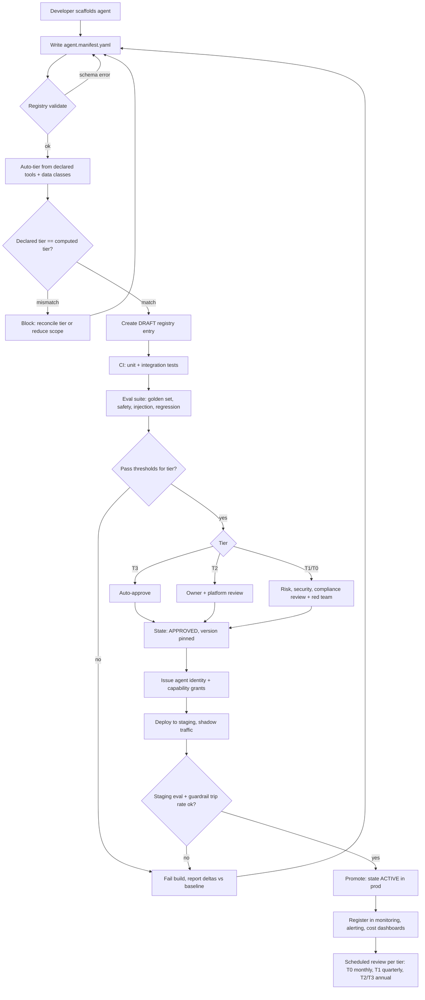
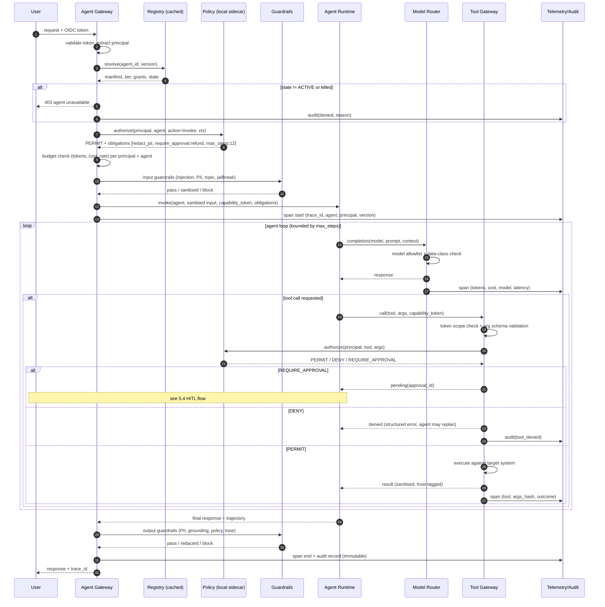
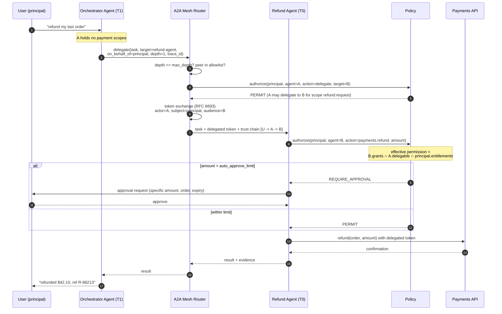
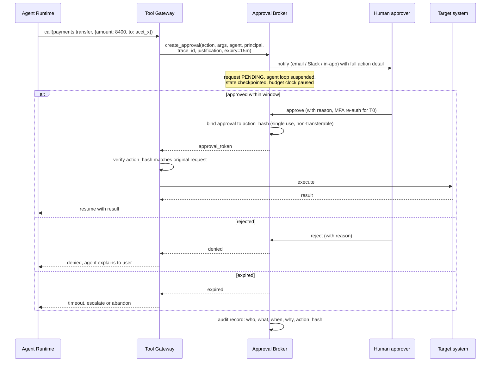
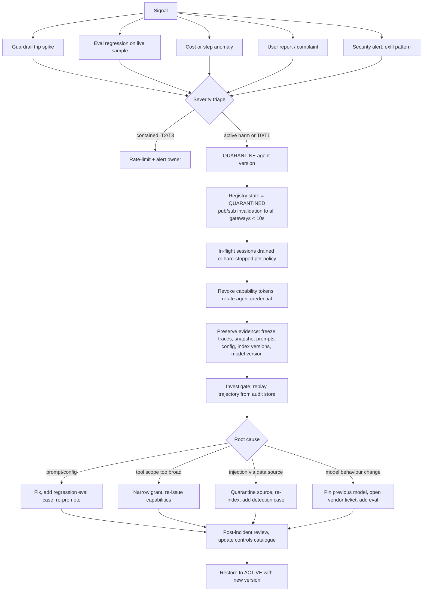

# Agent Governance: Zero to Hero

A working guide to governing autonomous and semi-autonomous AI agents in production — the
controls, the architecture, the data models, and the code. Written for platform engineers who
have to actually build the thing, not just write the policy.

**Scope:** LLM-backed agents that call tools, retrieve data, delegate to other agents, and take
actions with real-world consequences. Single-agent assistants through to multi-agent A2A meshes.

**Not legal advice.** The regulatory mapping in Part 8 is an engineering interpretation. Anything
that touches a regulated decision needs sign-off from your legal, compliance, and model risk
functions.

---

## Table of contents

| Part | Topic |
|---|---|
| [0](#part-0--why-agent-governance-is-a-different-problem) | Why agent governance is a different problem |
| [1](#part-1--the-risk-model) | The risk model |
| [2](#part-2--maturity-model-l0--l4) | Maturity model (L0 → L4) |
| [3](#part-3--the-eight-governance-primitives) | The eight governance primitives |
| [4](#part-4--end-to-end-reference-architecture) | End-to-end reference architecture |
| [5](#part-5--the-flows) | The flows (onboarding, runtime, delegation, HITL, incident) |
| [6](#part-6--component-deep-dives) | Component deep dives (registry, identity, policy, guardrails, telemetry, eval) |
| [7](#part-7--reference-implementation) | Reference implementation |
| [8](#part-8--control-mapping-to-external-frameworks) | Control mapping to external frameworks |
| [9](#part-9--rollout-roadmap) | Rollout roadmap |
| [10](#part-10--metrics-that-matter) | Metrics that matter |
| [11](#part-11--anti-patterns) | Anti-patterns |
| [12](#part-12--checklists) | Checklists |
| [13](#part-13--glossary) | Glossary |

---

## Part 0 — Why agent governance is a different problem

Most organisations already have model governance. They have a model inventory, a validation
process, a challenger-model requirement, monitoring for drift. Then agents arrive and the whole
apparatus turns out to be aimed at the wrong thing.

Classical model governance asks: *is this model's output accurate, stable, and fair?*

Agent governance has to ask: *what is this thing allowed to do, on whose behalf, with which data,
under what limits, and how do we prove afterwards what it actually did?*

The difference in one table:

| Dimension | Classical ML model | LLM agent |
|---|---|---|
| Unit of governance | The model artifact | The agent: model + prompt + tools + memory + policy |
| Output | A score or label | An action, a chain of actions, or a message to another agent |
| Determinism | Reproducible given inputs | Non-deterministic; same input, different trajectory |
| Blast radius | A decision | A side effect: money moved, ticket closed, email sent, record deleted |
| Input surface | Structured features | Untrusted natural language, retrieved documents, tool outputs |
| Failure mode | Wrong prediction | Wrong action, wrong recipient, wrong scope, infinite loop |
| Change velocity | Quarterly retrains | Prompt edits daily, tool additions weekly, model swaps monthly |
| Identity | N/A | The agent needs one, and needs to act on behalf of a human |
| Composition | Standalone | Calls other agents you may not own |

Three consequences fall out of this, and they shape everything else in this document.

**1. The governable unit is the agent configuration, not the model.**
A single foundation model backs a hundred agents. Governing the model tells you almost nothing.
The thing that determines risk is the *binding*: this model, with this system prompt, holding
these tool grants, reading this data, acting for this user population. That binding needs a
version, an owner, an approval record, and an identity.

**2. Governance has to be enforced at runtime, not just at review time.**
You cannot review your way to safety on a system whose behaviour is sampled from a distribution.
Design review catches design flaws. It does not catch the agent that, on turn 14 of a real
conversation, decides the most helpful thing to do is issue a refund it was not authorised to
issue. That has to be caught by a policy decision point in the call path.

**3. Auditability is a first-class functional requirement, not an ops nicety.**
When someone asks "why did the agent do that on 3 March at 14:22," the answer has to be
reconstructable from stored evidence: the prompt, the retrieved context, the tool calls, the
policy decisions, the identity, the approvals. If your telemetry is sampled at 10% and your
prompts aren't versioned, you cannot answer. In a regulated setting, not being able to answer is
itself the finding.

### The one-sentence definition

> Agent governance is the set of controls that ensure every agent in the estate is **known**,
> **owned**, **bounded**, **observable**, **evaluated**, and **revocable**.

Six words. Everything below is machinery for those six words.

---

## Part 1 — The risk model

Governance without a threat model turns into paperwork. Start here.

### 1.1 Agent-specific failure classes

```
                            ┌──────────────────────────┐
                            │      AGENT FAILURE       │
                            └────────────┬─────────────┘
                 ┌───────────────────────┼────────────────────────┐
                 │                       │                        │
        ┌────────▼────────┐    ┌─────────▼────────┐     ┌─────────▼────────┐
        │   INPUT-SIDE    │    │   DECISION-SIDE  │     │   ACTION-SIDE    │
        ├─────────────────┤    ├──────────────────┤     ├──────────────────┤
        │ Prompt injection│    │ Excessive agency │     │ Unauthorised tool│
        │ Poisoned RAG    │    │ Goal drift       │     │ Wrong recipient  │
        │ Malicious tool  │    │ Hallucinated     │     │ Irreversible op  │
        │  output         │    │  justification   │     │ Data exfil       │
        │ Context overflow│    │ Loop / no-halt   │     │ Cost runaway     │
        │ Untrusted agent │    │ Confident error  │     │ Cross-tenant leak│
        │  message (A2A)  │    │                  │     │                  │
        └─────────────────┘    └──────────────────┘     └──────────────────┘
```

**Input-side.** The agent's context window is an untrusted input channel. Anything that reaches
it — a retrieved PDF, a web page, a Jira comment, a message from another agent, an OCR'd
invoice — can carry instructions. Indirect prompt injection is the defining vulnerability of the
category, and there is no known complete mitigation. You reduce impact by constraining what the
agent can do after being injected, not by trying to detect every injection.

**Decision-side.** *Excessive agency* is the risk that the agent has more capability, more
permission, or more autonomy than the task requires. It is the agent equivalent of running
everything as root. The classic shape: a tool was added for one workflow, and now every agent
using that shared toolset can call it.

**Action-side.** Where the money is lost. The key distinction is **reversibility**. Reading a
record is cheap to get wrong. Sending a payment is not. Your control strength must scale with
reversibility, not with how impressive the tool sounds.

### 1.2 Multi-agent amplification

Every risk above gets worse when agents call agents.

- **Trust laundering.** Agent A is untrusted and low-privilege. It asks Agent B, which is
  trusted and high-privilege, to do something. If B accepts A's framing without re-checking
  authorisation against the *original* human principal, A has escalated privilege by asking
  nicely.
- **Confused deputy.** B holds credentials for a system. A cannot reach that system. A crafts a
  request that causes B to use its credentials on A's behalf. Classic, and very easy to build
  accidentally.
- **Injection propagation.** A document poisons Agent A. A's output becomes Agent B's input. The
  injection now runs with B's permissions. Sanitise at every hop, not just the perimeter.
- **Loop economics.** Two agents that call each other with no depth limit will burn your token
  budget until something external stops them. Depth and budget limits are safety controls, not
  cost controls.
- **Accountability diffusion.** Six agents from four teams contributed to one bad outcome. Without
  a correlated trace carrying the originating principal through every hop, root cause analysis
  is guesswork.

### 1.3 A usable risk-tiering rubric

Do not tier agents by "how AI they are." Tier by what happens when they are wrong. Score each
dimension 0–3, take the maximum, and let the maximum set the tier.

| Dimension | 0 | 1 | 2 | 3 |
|---|---|---|---|---|
| **Reversibility of actions** | Read-only | Reversible writes to internal systems | Writes visible to customers | Irreversible: payments, deletions, external filings |
| **Data sensitivity** | Public | Internal | Confidential / personal data | Regulated: PII at scale, payment, health, MNPI |
| **Autonomy** | Suggests only | Acts with per-action approval | Acts with post-hoc review | Acts unsupervised |
| **Population** | Single dev | One team | Whole enterprise | External customers |
| **Tool reach** | No tools | One read tool | Several internal tools | Internet, code execution, or arbitrary tool discovery |
| **Delegation** | None | Calls agents you own | Calls agents another team owns | Calls agents outside the org |

| Max score | Tier | Baseline requirement |
|---|---|---|
| 0–1 | **T3 — Low** | Registered, owned, traced. Self-service approval. |
| 2 | **T2 — Moderate** | Above + eval gate before promotion, tool allowlist, budget caps, quarterly review. |
| 3 (one dimension) | **T1 — High** | Above + independent review, human-in-the-loop on irreversible actions, red-team before launch, full trace retention, kill switch tested. |
| 3 (two or more) | **T0 — Critical** | Above + formal risk sign-off, dual control on production changes, continuous online evaluation, documented decision rationale for every action, pre-agreed rollback and incident playbook. |

The rubric is the contract between platform and product teams. Publish it. Make the tier a field
in the registry. Make the pipeline enforce the baseline for the declared tier and refuse to
promote agents whose declared tier is inconsistent with their declared tools.

### 1.4 Mapping to OWASP LLM Top 10 (2025)

Useful because your security team already knows this list.

| OWASP ID | Risk | Primary governance control (see Part 6) |
|---|---|---|
| LLM01 | Prompt injection | Trust-boundary tagging, output-driven action confirmation, least privilege |
| LLM02 | Sensitive information disclosure | Egress DLP, data classification on tool grants, response redaction |
| LLM03 | Supply chain | Registry provenance, model/tool/MCP-server allowlists, pinned versions |
| LLM04 | Data and model poisoning | Corpus provenance, RAG source allowlists, index change control |
| LLM05 | Improper output handling | Structured output validation, no raw model output into eval/exec sinks |
| LLM06 | Excessive agency | Capability tokens, scoped tool grants, HITL on irreversible ops |
| LLM07 | System prompt leakage | No secrets in prompts, prompt as versioned non-secret artifact |
| LLM08 | Vector and embedding weaknesses | Per-tenant index isolation, ACL-aware retrieval |
| LLM09 | Misinformation | Grounding requirements, citation enforcement, eval gates |
| LLM10 | Unbounded consumption | Token/cost/step/depth budgets enforced at the gateway |

---

## Part 2 — Maturity model (L0 → L4)

Be honest about where you are. Most enterprises attempting this are at L1 and telling themselves
they are at L3.

```
L0  SHADOW          L1  INVENTORIED      L2  CONTROLLED       L3  ASSURED           L4  ADAPTIVE
─────────────────   ──────────────────   ──────────────────   ──────────────────    ──────────────────
Agents exist in     There is a list.     Policy enforced at   Continuous eval.      Policy tuned from
notebooks and       Owners named.        runtime. Central     Online guardrails.    live signal. Risk
side projects.      Traces partial.      gateway. Tool        Automated promotion   scoring per request.
Nobody knows how    Controls are         allowlists. Budgets. gates. Kill switch    Auto-quarantine on
many. No traces.    review-time only,    Audit log complete.  drilled. Incident     anomaly. Governance
No owner list.      not runtime.         Eval before launch.  response owned.       is a product.

Typical: month 0    Typical: month 1-2   Typical: month 3-5   Typical: month 6-10   Typical: year 2+
```

### What each level actually requires

**L0 → L1: make the estate visible.**
An agent registry with mandatory registration. A manifest schema. An owner and a tier on every
entry. Discovery scanning to find the agents that did not register (grep your repos for the SDK
import, scan gateway logs for unregistered client IDs). Do not try to enforce anything yet.
Enforcement before visibility just pushes agents underground, and shadow agents are strictly
worse than ungoverned registered ones.

**L1 → L2: put a policy decision point in the call path.**
This is the hard architectural step and the one that pays for everything else. Every model call
and every tool call goes through a gateway that resolves the agent's identity, evaluates policy,
enforces budgets, and emits a trace. Direct-to-provider network egress gets blocked at the
firewall so the gateway cannot be bypassed. Once you have this, most other controls become
configuration.

**L2 → L3: close the loop with evidence.**
Evaluation suites that gate promotion. Online guardrails that sample production traffic. A kill
switch that has actually been tested in production, not just designed. An incident playbook with
a named on-call. Retention of traces long enough to satisfy your audit period.

**L3 → L4: feed runtime signal back into policy.**
Per-request risk scoring. Automatic quarantine of an agent version whose eval scores or guardrail
trip rate regress. Policy recommendations derived from observed tool usage — the registry notices
an agent has held `payments.refund` for 90 days and never called it, and proposes revocation.

### Self-assessment

Score yourself. If you cannot answer a question with evidence in under five minutes, the answer
is no.

- [ ] Can you produce a list of every agent running in production, with an owner, in under 5 minutes?
- [ ] For a given agent, can you list exactly which tools it may call and which data it may read?
- [ ] Is there any network path from an agent to a model provider that bypasses your gateway?
- [ ] Can you reconstruct the full decision trail of a specific agent interaction from 30 days ago?
- [ ] Can you disable one agent version, in production, without a deploy?
- [ ] Does a prompt change go through the same gate as a code change?
- [ ] Do you know your token spend per agent, per tenant, today?
- [ ] Has anyone red-teamed the agent with the largest blast radius?
- [ ] When an agent calls another team's agent, does the original user's identity travel with the call?
- [ ] Do you have an eval suite that would fail if someone swapped the underlying model?

0–3 yes: L0/L1. 4–6: L2. 7–9: L3. 10: either L4 or over-confident.

---

## Part 3 — The eight governance primitives

Everything in the architecture is an implementation of one of these. If a proposed control does
not map to one, question whether it belongs.

### P1 — Identity
Every agent has a cryptographic identity distinct from the human it serves and from the workload
it runs on. Three identities are in play on any call and all three must be present in the audit
record:

- **Workload identity** — the process/pod. SPIFFE ID or equivalent. Proves *where* the code runs.
- **Agent identity** — the logical agent + version. Proves *what* is asking.
- **Principal identity** — the human or system on whose behalf the action is taken. Proves *for whom*.

Collapsing these is the single most common design error. A service account shared by five agents
destroys attribution and makes least privilege impossible.

### P2 — Registration
No agent reaches production without a registry entry. The registry entry is the governance
artifact: the manifest, the version, the owner, the tier, the tool grants, the data
classifications, the approvals, the eval results. If it is not in the registry, the gateway
refuses to issue it a token.

### P3 — Authorisation
Capability-based, not role-based. The agent presents a token that enumerates exactly which tools
and scopes it may use, for how long, for which principal. The tool-side authorisation is the
intersection of the agent's grant and the principal's own entitlement. An agent must never be
able to do something the human it serves could not do themselves.

### P4 — Containment
Bounded resources and bounded reach: token budgets, wall-clock timeouts, step limits, delegation
depth limits, network egress allowlists, sandboxed execution for code tools, per-tenant data
isolation. Containment is what makes injection survivable.

### P5 — Observability
Structured, correlated telemetry across every hop: prompts, retrieved context references, tool
calls and their arguments, policy decisions, token usage, latency, errors, human approvals.
OpenTelemetry-based so it lands in the tooling you already run. Sampling is fine for performance
metrics and unacceptable for the audit trail on T0/T1 agents.

### P6 — Evaluation
Offline suites that gate promotion, online evaluation that samples production, and regression
detection that compares versions. Evaluation is the only mechanism that turns "we think it's
fine" into evidence. Golden datasets are versioned artifacts with owners, like code.

### P7 — Human control
Explicit approval for irreversible or high-value actions, with the approval bound to the specific
action and expiring. Plus the meta-control: a kill switch that removes an agent version from
service in seconds, and a documented escalation path.

### P8 — Lifecycle
Agents are born, change, and die. Version everything (prompt, tools, model, policy). Promote
through environments with gates. Review on a cadence tied to tier. Deprecate and decommission
deliberately, including revoking credentials and archiving traces. Most estates have no
decommissioning process at all, which is how you end up with an agent nobody owns holding a live
production token.

### The primitives as a stack

```
                    ┌─────────────────────────────────────────────┐
   P8 LIFECYCLE ────│  register → approve → promote → review →     │──── spans everything
                    │  deprecate → decommission                   │
                    └─────────────────────────────────────────────┘
                    ┌──────────────┬──────────────┬───────────────┐
   BUILD TIME       │ P2 Register  │ P6 Evaluate  │ P3 Grant      │
                    └──────────────┴──────────────┴───────────────┘
                    ┌──────────────┬──────────────┬───────────────┐
   RUN TIME         │ P1 Identify  │ P3 Authorise │ P4 Contain    │
                    │              │              │ P7 Approve    │
                    └──────────────┴──────────────┴───────────────┘
                    ┌─────────────────────────────────────────────┐
   ALWAYS ON        │ P5 Observe — trace, log, meter, audit       │
                    └─────────────────────────────────────────────┘
```

---

## Part 4 — End-to-end reference architecture

### 4.1 The whole picture

```
┌────────────────────────────────────────────────────────────────────────────────────────┐
│                                    CONSUMERS                                           │
│    Web / mobile app     Internal portal     Batch job     Partner system     CLI       │
└────────────────────────────────────┬───────────────────────────────────────────────────┘
                                     │  user identity (OIDC), request context
                                     ▼
┌────────────────────────────────────────────────────────────────────────────────────────┐
│                        ① AGENT GATEWAY  (the chokepoint)                               │
│                                                                                        │
│   AuthN ──▶ Agent resolution ──▶ PDP call ──▶ Budget check ──▶ Input guardrails         │
│                                                                                        │
│   ◀── Output guardrails ◀── Response assembly ◀── Trace emit ◀── Meter emit             │
│                                                                                        │
│   Rejects: unregistered agents, expired versions, killed agents, over-budget, denied    │
└──┬─────────────────────────────────────────────────────────────────────────────────┬───┘
   │                                                                                 │
   │ ② CONTROL PLANE (build time + policy)          ③ RUNTIME PLANE (execution)      │
   ▼                                                                                 ▼
┌──────────────────────────────────────┐        ┌────────────────────────────────────────┐
│  AGENT REGISTRY                      │        │  AGENT RUNTIME                         │
│   • manifests (versioned)            │        │   • orchestration loop                 │
│   • owners, tiers, approvals         │◀──────▶│   • planner / executor                 │
│   • tool grants, data classes        │ resolve│   • memory + state store               │
│   • lifecycle state                  │        │   • framework adapter (ADK/LangGraph/  │
│   • provenance + SBOM                │        │     MAF/CrewAI/custom)                 │
├──────────────────────────────────────┤        └──┬──────────────┬──────────────┬───────┘
│  POLICY DECISION POINT (PDP)         │           │              │              │
│   • OPA / Cedar / Rego bundles       │           ▼              ▼              ▼
│   • capability token issuance        │      ┌─────────┐  ┌───────────┐  ┌────────────┐
│   • obligations (redact, approve)    │      │ ④ MODEL │  │ ⑤ TOOL    │  │ ⑥ AGENT    │
├──────────────────────────────────────┤      │  ROUTER │  │  GATEWAY  │  │  MESH      │
│  PROMPT + CONFIG STORE               │      │         │  │  (MCP)    │  │  (A2A)     │
│   • versioned, signed, diffable      │      │ • model │  │ • allowl. │  │ • agent    │
├──────────────────────────────────────┤      │   allow │  │ • schema  │  │   cards    │
│  EVALUATION SERVICE                  │      │ • fallb.│  │   valid.  │  │ • trust    │
│   • offline suites, golden sets      │      │ • cost  │  │ • per-call│  │   chain    │
│   • online samplers, judges          │      │   meter │  │   authz   │  │ • depth    │
│   • regression gates                 │      │ • redact│  │ • sandbox │  │   limit    │
├──────────────────────────────────────┤      └────┬────┘  └─────┬─────┘  └─────┬──────┘
│  APPROVAL BROKER (HITL)              │           │             │              │
│   • pending action queue             │           ▼             ▼              ▼
│   • notify, approve, expire          │      ┌─────────┐  ┌───────────┐  ┌────────────┐
├──────────────────────────────────────┤      │ LLM     │  │ Internal  │  │ Peer       │
│  KILL SWITCH / QUARANTINE            │      │ vendors │  │ APIs, DBs │  │ agents     │
│   • disable version, agent, or tool  │      │ + self- │  │ SaaS, RAG │  │ (internal  │
│   • propagates in seconds            │      │ hosted  │  │ code exec │  │ + external)│
└──────────────────────────────────────┘      └─────────┘  └───────────┘  └────────────┘
   │                                                 │             │              │
   └───────────────────────┬─────────────────────────┴─────────────┴──────────────┘
                           ▼
┌────────────────────────────────────────────────────────────────────────────────────────┐
│                       ⑦ OBSERVABILITY & ASSURANCE PLANE                                │
│                                                                                        │
│  OTel collector ──▶ traces (spans per LLM call, tool call, agent hop, policy decision)  │
│                ──▶ metrics (tokens, cost, latency, guardrail trips, denials)            │
│                ──▶ logs (structured, correlated by trace_id)                            │
│                ──▶ IMMUTABLE AUDIT STORE (WORM, retention by tier)                      │
│                                                                                        │
│  Consumers: eval service · anomaly detection · cost mgmt · risk dashboards · audit      │
└────────────────────────────────────────────────────────────────────────────────────────┘
```

### 4.2 What each block is responsible for

**① Agent Gateway.** The single enforcement point. Everything an agent does that leaves its
process goes through here. Its power comes entirely from being unavoidable — if there is a
network path around it, the architecture is decorative. Block direct egress to model provider
domains at the network layer and let the gateway be the only route out.

**② Control plane.** Slow-moving, strongly consistent, human-approved. The registry is the source
of truth for what exists; the PDP is the source of truth for what is allowed. Both are read on
the hot path, so both need caching with short TTLs and a fast invalidation channel for the kill
switch.

**③ Runtime plane.** Where the agent loop actually runs. Deliberately framework-agnostic. The
governance controls sit outside the framework so that swapping LangGraph for Google ADK or the
Microsoft Agent Framework does not require re-implementing governance. This is the argument for
putting enforcement in a gateway rather than in an SDK: SDK-level controls are advisory, because
the SDK is a library the agent author can choose not to call.

**④ Model router.** Model allowlist per agent and per data classification, cost metering, prompt
and response redaction hooks, fallback and circuit-breaking. This is where "this agent may not
send confidential data to an external provider" becomes an enforced rule rather than a slide.

**⑤ Tool gateway (MCP).** Tool discovery, schema validation, per-call authorisation, argument
inspection, sandboxing for anything that executes. MCP gives you a uniform shape for tools, which
is exactly what a governance layer needs — one interception point instead of one per integration.

**⑥ Agent mesh (A2A).** Agent-to-agent calls with propagated principal identity, a trust chain,
and a delegation depth limit. Peer agents are treated as tools with additional trust metadata.

**⑦ Observability plane.** Not optional and not "phase two." The audit store is separate from the
observability store: observability is sampled, mutable, and short-retention; audit is complete,
immutable, and retained per tier. Conflating them is how teams discover during an audit that the
evidence was aged out after 14 days.

### 4.3 Deployment shape

```
       Ingress
          │
   ┌──────▼───────┐        ┌──────────────┐        ┌───────────────┐
   │ Gateway pods │◀──────▶│ Policy sidecar│◀──────▶│ OPA bundle CDN│
   │  (stateless) │  local │ (OPA/Cedar)   │  pull  │  (signed)     │
   └──────┬───────┘  eval  └──────────────┘        └───────────────┘
          │
          │ resolve (cached 30s)      ┌────────────────────┐
          ├──────────────────────────▶│ Registry (Postgres)│
          │                           └────────────────────┘
          │ invalidate (pub/sub)      ┌────────────────────┐
          ├◀──────────────────────────│ Kill switch topic  │
          │                           └────────────────────┘
          │ emit (OTLP)               ┌────────────────────┐
          └──────────────────────────▶│ Collector → Kafka  │──▶ audit WORM store
                                      └────────────────────┘         (S3 Object Lock)
```

Policy evaluation runs **local to the gateway** as a sidecar or embedded library with bundles
pulled from a signed distribution point. Do not make a network call to a central PDP on every
tool call; you will regret it at p99. Central PDP for bundle authoring, local evaluation for
enforcement.

---

## Part 5 — The flows

### 5.1 Agent onboarding and promotion



The important property: **the manifest is the input to everything**. Tiering, policy generation,
eval selection, and monitoring configuration all derive from it. Developers write one file; the
platform derives the controls. If governance requires developers to fill in five different
systems, they will not do it.

### 5.2 Runtime request flow (the critical path)



Five decision points, all of them mandatory, none of them in the agent's own code:

1. **Is this agent allowed to run at all?** (registry state + kill switch)
2. **Is this principal allowed to use this agent for this?** (PDP, invoke)
3. **Is there budget?** (containment)
4. **Is the input safe to process?** (input guardrails)
5. **Is this specific tool call, with these specific arguments, allowed right now?** (PDP, per call)

Point 5 is the one teams skip and the one that matters most. Authorising the agent at session
start and then trusting every tool call for the rest of the session is equivalent to checking a
badge at the front door and leaving every internal door unlocked.

### 5.3 Multi-agent delegation with identity propagation



Four rules for delegation, all non-negotiable:

- **Identity propagates, privilege does not.** B acts for the original user, using B's own grants
  intersected with what A was allowed to delegate. A never gains B's capabilities.
- **The trust chain is carried and logged.** `U → A → B` appears in every downstream audit record.
  Truncate the chain and you lose attribution permanently.
- **Depth is bounded.** A hard `max_delegation_depth` (3 is a sane default) plus cycle detection
  on the chain. Reject, do not warn.
- **Peer output is untrusted input.** B's response gets the same trust tagging and guardrail
  treatment as a retrieved document, because B may itself have been injected.

### 5.4 Human-in-the-loop approval



The subtle part is `action_hash` binding. An approval must authorise *this exact action with
these exact arguments*, not "a refund." Otherwise an agent can obtain approval for a $10 refund
and execute a $10,000 one. Hash the canonicalised arguments, bind the approval to the hash, and
re-verify at execution time.

Approval fatigue is a real failure mode. If humans approve 200 actions a day they stop reading.
Reserve HITL for genuinely irreversible or high-value actions, and set auto-approve thresholds
that get tuned from data. Approval rate above ~95% with no rejections means the threshold is
wrong and you are training people to click yes.

### 5.5 Incident response and kill switch



Two requirements that get missed:

**The kill switch must not require a deploy.** If disabling a misbehaving agent means a CI
pipeline and a rolling restart, your mean time to containment is 20 minutes minimum. Registry
state change plus cache invalidation gives you seconds.

**Evidence freeze comes before investigation.** Prompts get edited, indexes get re-built, models
get silently updated by the vendor. Snapshot the full configuration set at incident time or you
will be investigating a system that no longer exists.

### 5.6 Data flow and trust boundaries

```
   TRUSTED                    SEMI-TRUSTED                  UNTRUSTED
   ────────                   ────────────                  ─────────
 System prompt          Tool results (internal)        User input
 Registry config        Peer agent output              Retrieved documents
 Capability token       Memory / conversation state    Web content
 Policy obligations                                    OCR'd files
                                                       External agent output
        │                        │                            │
        │                        │                            │
        ▼                        ▼                            ▼
 ┌──────────────────────────────────────────────────────────────────────┐
 │                          CONTEXT ASSEMBLY                            │
 │  Every segment is tagged with its trust level and its source id.     │
 │  Untrusted segments are delimited and never merged with instructions.│
 └──────────────────────────────┬───────────────────────────────────────┘
                                ▼
                        ┌───────────────┐
                        │   MODEL CALL  │
                        └───────┬───────┘
                                ▼
 ┌──────────────────────────────────────────────────────────────────────┐
 │   ACTION GATE — the key rule:                                        │
 │   An action's required approval level is raised when the             │
 │   trajectory that produced it contains untrusted content.            │
 │                                                                      │
 │   read-only + untrusted context      → allow                         │
 │   reversible write + untrusted       → allow, log, sample review     │
 │   irreversible + untrusted context   → REQUIRE HUMAN APPROVAL        │
 │   irreversible + trusted only        → policy limits apply           │
 └──────────────────────────────────────────────────────────────────────┘
```

This is the practical answer to prompt injection. You cannot reliably detect it. You *can* make
the consequence of a successful injection bounded, by refusing to let untrusted context drive
irreversible actions without a human in the path. Track trust provenance through the trajectory
and let it modulate the authorisation decision.

---

## Part 6 — Component deep dives

### 6.1 The agent manifest

The manifest is the contract. One file, checked into the agent's repo, validated in CI, published
to the registry. Everything else derives from it.

```yaml
# agent.manifest.yaml
apiVersion: governance/v1
kind: Agent

metadata:
  id: refund-orchestrator                 # stable, immutable, globally unique
  version: 3.2.0                          # semver; prompt change = minor, model change = major
  displayName: Refund Orchestrator
  description: >
    Handles customer refund requests end to end: validates eligibility,
    calculates amount, requests approval, issues refund.
  owner:
    team: consumer-servicing-ai
    technicalContact: platform-team@example.com
    businessOwner: jane.doe@example.com   # accountable human, not a distribution list
  labels:
    domain: servicing
    costCenter: CC-40218
    lineOfBusiness: consumer

classification:
  declaredTier: T0                        # cross-checked against computed tier
  autonomy: acts_with_approval            # suggests_only | acts_with_approval |
                                          # acts_with_review | autonomous
  reversibility: irreversible
  userPopulation: external_customers
  dataClassifications: [pii, payment_card, internal]
  jurisdictions: [US, EU]                 # drives residency + regulatory obligations
  humanOversight:
    mode: human_in_the_loop
    triggers:
      - action: payments.refund
        condition: amount > 100 OR trajectory.contains_untrusted
      - action: "*"
        condition: confidence < 0.7

model:
  primary:
    provider: internal-gateway
    name: claude-sonnet-4-5
    pinned: true                          # T0/T1 must pin; no silent vendor upgrades
  fallback:
    name: claude-haiku-4-5
    conditions: [primary_unavailable, cost_ceiling_reached]
  parameters:
    temperature: 0.2
    maxOutputTokens: 2048
  constraints:
    allowExternalProviders: false         # enforced by model router for pii/payment_card
    allowTraining: false                  # no data retention for training

prompt:
  ref: prompts/refund-orchestrator/v3.2.0.md
  sha256: 9f2c1a...                       # signed, immutable, diffable in review
  systemPromptContainsSecrets: false      # asserted and scanned in CI

tools:
  - name: orders.lookup
    server: mcp://internal/orders
    scopes: [orders:read]
    dataAccess: [pii]
    justification: Needed to verify order exists and belongs to caller.
  - name: payments.refund
    server: mcp://internal/payments
    scopes: [payments:refund]
    dataAccess: [payment_card]
    constraints:
      maxAmountPerCall: 500
      maxAmountPerDay: 5000
      requiresApprovalAbove: 100
      idempotencyRequired: true
    justification: Core function. Irreversible; approval-gated.
  - name: knowledge.search
    server: mcp://internal/kb
    scopes: [kb:read]
    dataAccess: [internal]
    justification: Retrieves refund policy text for grounding.

delegation:
  mayDelegateTo:
    - agent: eligibility-checker
      scopes: [orders:read]
      maxDepth: 1
    - agent: fraud-screener
      scopes: [risk:score]
      maxDepth: 1
  mayBeDelegatedBy: [servicing-front-door]
  maxInboundDepth: 2

data:
  retrieval:
    sources:
      - id: refund-policy-index
        classification: internal
        aclAware: true                    # retrieval filters by caller entitlement
    disallowedSources: ["*://external/*"]
  memory:
    type: session
    ttl: 24h
    piiRedaction: true
  residency:
    storeIn: [us-east-1, eu-west-1]
    crossBorderTransfer: false

limits:
  maxSteps: 12
  maxWallClockSeconds: 90
  maxTokensPerSession: 60000
  maxCostPerSessionUsd: 0.75
  maxSessionsPerUserPerDay: 20
  maxDelegationDepth: 3

guardrails:
  input:  [prompt_injection, jailbreak, pii_detection, off_topic]
  output: [pii_leakage, groundedness, policy_compliance, toxicity]
  onTrip:
    prompt_injection: block_and_alert
    groundedness: regenerate_once_then_escalate
    pii_leakage: redact_and_log

evaluation:
  suites:
    - name: refund-golden-set
      version: 2026-08-14
      threshold: {accuracy: 0.95, groundedness: 0.98}
    - name: safety-adversarial
      threshold: {injection_resistance: 0.99, unauthorized_action_rate: 0.0}
    - name: regression-vs-baseline
      baseline: 3.1.0
      threshold: {no_metric_regression_beyond: 0.02}
  online:
    samplingRate: 0.05                    # graded by judge model + human sample
    alertOn: {groundedness: "< 0.9 over 1h"}

observability:
  traceRetentionDays: 2555                # 7 years, tier-driven
  auditImmutable: true
  captureFullPrompts: true                # required for T0/T1; PII-redacted at rest
  piiRedactionInTraces: true

lifecycle:
  state: ACTIVE                           # DRAFT|APPROVED|ACTIVE|DEPRECATED|QUARANTINED|RETIRED
  reviewCadence: monthly
  approvals:
    - type: security
      by: sec-review-board
      at: 2026-08-02T10:14:00Z
      evidence: JIRA-SEC-4471
    - type: model_risk
      by: mrm-team
      at: 2026-08-05T09:02:00Z
      evidence: MRM-2026-0114
  deprecation:
    supersededBy: null
    sunsetDate: null
```

**Design notes.**

- `declaredTier` is checked against a tier *computed* from the tools, data classes, autonomy, and
  population. Mismatch fails the build. This stops the "we're just a low-risk chatbot" claim from
  an agent holding `payments.refund`.
- `justification` on every tool grant is deliberate friction. It is the single most effective
  control against excessive agency, because it makes an author defend each capability in a diff
  a reviewer can see.
- The prompt lives outside the manifest but is referenced by hash. Prompts are code. They get
  reviewed, versioned, and signed.
- `pinned: true` on the model matters more than people expect. Providers update models; behaviour
  shifts; your eval baseline silently becomes invalid. For T0/T1, pin and upgrade deliberately
  with a re-run of the eval suite.

### 6.2 Agent registry

The registry is boring infrastructure that everything depends on. Postgres is fine. The
interesting parts are the API surface and the invariants.

**Core schema:**

```sql
CREATE TABLE agent (
    id                TEXT PRIMARY KEY,          -- stable identifier
    display_name      TEXT NOT NULL,
    owner_team        TEXT NOT NULL,
    business_owner    TEXT NOT NULL,
    created_at        TIMESTAMPTZ NOT NULL DEFAULT now(),
    retired_at        TIMESTAMPTZ
);

CREATE TABLE agent_version (
    agent_id          TEXT NOT NULL REFERENCES agent(id),
    version           TEXT NOT NULL,             -- semver
    manifest          JSONB NOT NULL,
    manifest_sha256   TEXT NOT NULL,
    prompt_sha256     TEXT NOT NULL,
    declared_tier     TEXT NOT NULL,
    computed_tier     TEXT NOT NULL,
    state             TEXT NOT NULL,             -- DRAFT..RETIRED
    eval_results      JSONB,
    provenance        JSONB,                     -- git sha, builder, sbom ref, signature
    created_at        TIMESTAMPTZ NOT NULL DEFAULT now(),
    activated_at      TIMESTAMPTZ,
    PRIMARY KEY (agent_id, version),
    CONSTRAINT tier_consistent CHECK (declared_tier = computed_tier)
);

-- exactly one ACTIVE version per agent per environment
CREATE UNIQUE INDEX one_active_version
    ON agent_version (agent_id)
    WHERE state = 'ACTIVE';

CREATE TABLE tool_grant (
    agent_id     TEXT NOT NULL,
    version      TEXT NOT NULL,
    tool_name    TEXT NOT NULL,
    server       TEXT NOT NULL,
    scopes       TEXT[] NOT NULL,
    constraints  JSONB,
    justification TEXT NOT NULL,
    granted_by   TEXT NOT NULL,
    granted_at   TIMESTAMPTZ NOT NULL DEFAULT now(),
    revoked_at   TIMESTAMPTZ,
    FOREIGN KEY (agent_id, version) REFERENCES agent_version(agent_id, version)
);

CREATE TABLE approval_record (
    id           UUID PRIMARY KEY,
    agent_id     TEXT NOT NULL,
    version      TEXT NOT NULL,
    approval_type TEXT NOT NULL,        -- security | model_risk | privacy | business
    approver     TEXT NOT NULL,
    decision     TEXT NOT NULL,
    evidence_ref TEXT,
    decided_at   TIMESTAMPTZ NOT NULL
);

CREATE TABLE lifecycle_event (           -- append-only
    id           BIGSERIAL PRIMARY KEY,
    agent_id     TEXT NOT NULL,
    version      TEXT,
    event        TEXT NOT NULL,          -- REGISTERED, PROMOTED, QUARANTINED, ...
    actor        TEXT NOT NULL,
    reason       TEXT,
    payload      JSONB,
    occurred_at  TIMESTAMPTZ NOT NULL DEFAULT now()
);
```

**Invariants the registry enforces:**

1. One `ACTIVE` version per agent per environment. No ambiguity about what is running.
2. `declared_tier == computed_tier`. Enforced by constraint, not by review.
3. No `ACTIVE` transition without approvals matching the tier's requirement.
4. No tool grant without a justification string.
5. Every state change writes a `lifecycle_event`. The event table is append-only and is part of
   the audit evidence.
6. Retiring an agent revokes all grants and credentials in the same transaction.

**API surface:**

```
POST   /agents                              register (DRAFT)
POST   /agents/{id}/versions                new version
POST   /agents/{id}/versions/{v}:promote    DRAFT → APPROVED → ACTIVE (gated)
POST   /agents/{id}/versions/{v}:quarantine kill switch, immediate
GET    /agents/{id}/versions/{v}/resolve    hot-path read, ETag + 30s cache
GET    /agents?tier=T0&state=ACTIVE         inventory queries for risk reporting
GET    /agents/{id}/lineage                 which agents call this one, and vice versa
DELETE /agents/{id}                         retire, cascade revoke
```

The `lineage` endpoint pays for itself the first time someone asks "if we quarantine the fraud
screener, what breaks?"

### 6.3 Identity and capability tokens

Three identities, one token. The capability token is what the gateway hands the runtime and what
the tool gateway verifies.

```json
{
  "iss": "https://agent-gateway.internal",
  "sub": "user:1a2b3c",
  "aud": ["mcp://internal/payments", "mcp://internal/orders"],
  "exp": 1789012345,
  "iat": 1789012045,
  "jti": "cap_01J9X8...",

  "agent": {
    "id": "refund-orchestrator",
    "version": "3.2.0",
    "tier": "T0",
    "manifest_sha256": "9f2c1a..."
  },
  "workload": {
    "spiffe_id": "spiffe://example.com/ns/agents/sa/refund-orchestrator"
  },
  "act": [
    { "sub": "agent:servicing-front-door", "ver": "1.4.1" },
    { "sub": "agent:refund-orchestrator", "ver": "3.2.0" }
  ],

  "capabilities": [
    { "tool": "orders.lookup",   "scopes": ["orders:read"] },
    { "tool": "payments.refund", "scopes": ["payments:refund"],
      "constraints": { "max_amount": 500, "requires_approval_above": 100,
                       "idempotency": "required" } }
  ],
  "obligations": ["redact_pii_in_output", "log_full_trajectory"],
  "limits": { "max_steps": 12, "max_tokens": 60000, "max_cost_usd": 0.75,
              "max_delegation_depth": 3, "current_depth": 1 },
  "trace_id": "4bf92f3577b34da6a3ce929d0e0e4736"
}
```

Properties that matter:

- **Short lived.** Minutes, not hours. Bound to a session, not to the agent as a standing grant.
- **Audience restricted.** A token issued for the payments server cannot be replayed against a
  different server.
- **Actor chain (`act`).** RFC 8693 token exchange semantics. The chain is the delegation trail.
  Each hop appends; nothing is ever removed.
- **Constraints travel with the capability.** The tool gateway enforces `max_amount` without
  needing to call back to the registry.
- **`current_depth` increments on delegation.** Exceeding `max_delegation_depth` fails token
  exchange, so the limit is enforced at issuance rather than by convention.

**Effective permission** is always an intersection, computed at the tool gateway:

```
effective = agent.capabilities
          ∩ principal.entitlements          # the human's own access
          ∩ delegator.delegable_scopes      # what the calling agent could pass on
          ∩ tool.policy_constraints         # tool-side limits
          − active_quarantines
```

If the principal cannot refund an order themselves, the agent cannot do it for them. This one
rule eliminates a large class of privilege escalation, and it is the rule most implementations
get wrong by giving the agent a service account with broad access.

### 6.4 Policy engine

Policy as code, evaluated locally, distributed as signed bundles. Rego shown here; Cedar works
equally well and has a nicer authorisation model for entity relationships.

```rego
package agent.authz

import rego.v1

default decision := {"effect": "DENY", "reason": "no matching rule"}

# ---------- agent invocation ----------

decision := {"effect": "PERMIT", "obligations": obligations} if {
    input.action == "invoke"
    agent := data.registry.agents[input.agent.id][input.agent.version]
    agent.state == "ACTIVE"
    not quarantined(input.agent)
    principal_allowed(input.principal, agent)
    obligations := invoke_obligations(agent, input)
}

quarantined(agent) if data.killswitch.versions[sprintf("%s@%s", [agent.id, agent.version])]
quarantined(agent) if data.killswitch.agents[agent.id]

principal_allowed(principal, agent) if {
    agent.classification.userPopulation == "external_customers"
    principal.type == "customer"
}
principal_allowed(principal, agent) if {
    some group in principal.groups
    group in agent.access.allowedGroups
}

invoke_obligations(agent, input) := obs if {
    obs := array.concat(
        [o | some o in agent.guardrails.obligations],
        [ "require_approval" | agent.classification.reversibility == "irreversible" ]
    )
}

# ---------- tool calls ----------

tool_decision := {"effect": "DENY", "reason": "tool not granted"} if {
    input.action == "tool_call"
    not granted_tool(input)
}

tool_decision := {"effect": "REQUIRE_APPROVAL", "reason": reason} if {
    input.action == "tool_call"
    granted_tool(input)
    needs_approval(input)
    reason := approval_reason(input)
}

tool_decision := {"effect": "PERMIT"} if {
    input.action == "tool_call"
    granted_tool(input)
    not needs_approval(input)
    within_constraints(input)
    entitled(input.principal, input.tool, input.args)
}

granted_tool(input) if {
    some cap in input.capabilities
    cap.tool == input.tool
    every s in required_scopes(input.tool) { s in cap.scopes }
}

# amount over threshold
needs_approval(input) if {
    some cap in input.capabilities
    cap.tool == input.tool
    input.args.amount > cap.constraints.requires_approval_above
}

# trust-boundary rule: untrusted context cannot drive irreversible actions unattended
needs_approval(input) if {
    data.tools[input.tool].reversibility == "irreversible"
    input.trajectory.contains_untrusted_content
}

# never let a low-tier agent invoke a high-blast-radius tool, regardless of grant drift
needs_approval(input) if {
    input.agent.tier in {"T2", "T3"}
    data.tools[input.tool].blast_radius == "high"
}

approval_reason(input) := "amount_over_threshold" if {
    some cap in input.capabilities
    cap.tool == input.tool
    input.args.amount > cap.constraints.requires_approval_above
}
approval_reason(input) := "untrusted_context_irreversible_action" if {
    data.tools[input.tool].reversibility == "irreversible"
    input.trajectory.contains_untrusted_content
}

within_constraints(input) if {
    some cap in input.capabilities
    cap.tool == input.tool
    not exceeds_amount(cap, input)
    input.usage.steps < input.limits.max_steps
    input.usage.cost_usd < input.limits.max_cost_usd
}

exceeds_amount(cap, input) if input.args.amount > cap.constraints.max_amount

entitled(principal, tool, args) if {
    # the agent can never exceed the human's own access
    some ent in principal.entitlements
    ent.resource == data.tools[tool].resource
    ent.action == data.tools[tool].action
}
```

**Deny by default.** The last line of every policy set is an implicit deny. Any rule that fails to
match produces DENY with a reason, and the reason is returned to the agent as a structured error
so it can replan rather than retry blindly.

Bundle distribution: build bundles in CI from the registry, sign them, publish to an internal CDN,
have sidecars poll every 30 seconds with signature verification. Kill-switch data goes in a
separate, faster-refreshing bundle (or a push channel) because containment latency matters.

### 6.5 Guardrails

Guardrails are runtime filters. They are necessary and they are not sufficient — they catch the
obvious and miss the novel. Layer them, and never treat them as your only control.

| Layer | Runs on | Checks | Typical action |
|---|---|---|---|
| Input | User message, retrieved docs, peer output | Injection patterns, jailbreak, PII, off-topic, language, size | Block, sanitise, tag as untrusted |
| Context | Assembled prompt | Trust tagging, secret scanning, size limits, source allowlist | Strip, truncate, refuse |
| Tool argument | Tool call args | Schema validation, injection in args, amount ranges, target allowlists | Deny, require approval |
| Tool result | Data returned from tools | Injection in results, unexpected size, sensitive fields | Sanitise, tag untrusted |
| Output | Final response | PII leakage, groundedness, policy compliance, toxicity, prompt leakage | Redact, regenerate, block |
| Trajectory | Whole session | Loops, step explosion, scope creep, anomalous tool sequences | Halt, alert, quarantine |

Implementation guidance:

- **Fail closed for safety checks, fail open for quality checks.** If the PII detector is down,
  block. If the groundedness scorer is down, log and proceed. Getting this backwards either makes
  you unsafe or makes you unavailable.
- **Budget the latency.** Input guardrails run on every request. A 400ms classifier chain is a
  400ms tax on your p50. Run cheap deterministic checks inline and expensive model-based checks
  asynchronously on a sample, unless the tier demands inline.
- **Trajectory guardrails are underrated.** The most useful anomaly signal is not any single call
  but the sequence: an agent that normally makes 3 tool calls suddenly making 40, or calling
  tools in an order it has never used. Baseline per agent version and alert on deviation.
- **Every trip is a telemetry event with a reason code.** Guardrail trip rate per agent per
  version is one of your best leading indicators of a regression.

### 6.6 Observability and the audit trail

Use OpenTelemetry. The GenAI semantic conventions are still evolving, so pin the version you
adopt and add your governance attributes in your own namespace so upstream changes do not break
your dashboards.

**Span hierarchy:**

```
agent.session                          [trace root]
├── governance.authorize               (invoke decision, obligations, latency)
├── guardrail.input                    (checks run, trips, reason codes)
├── agent.step (1..n)
│   ├── gen_ai.chat                    (model, tokens in/out, cost, finish reason)
│   ├── governance.authorize           (tool decision)
│   ├── approval.wait                  (approval_id, approver, wait time)
│   └── gen_ai.execute_tool            (tool, server, args hash, outcome, latency)
├── agent.delegate                     [child trace linked, depth, target agent]
│   └── ... peer agent session spans ...
├── guardrail.output
└── audit.record                       (immutable write confirmation)
```

**Attributes on every span:**

```
# governance namespace (yours)
governance.agent.id                 = "refund-orchestrator"
governance.agent.version            = "3.2.0"
governance.agent.tier               = "T0"
governance.principal.id             = "user:1a2b3c"          (pseudonymised)
governance.principal.type           = "customer"
governance.delegation.chain         = "front-door>refund-orchestrator"
governance.delegation.depth         = 1
governance.policy.decision          = "PERMIT" | "DENY" | "REQUIRE_APPROVAL"
governance.policy.rule_id           = "tool_amount_threshold"
governance.policy.bundle_version     = "2026-09-01T12:00Z"
governance.prompt.sha256            = "9f2c1a..."
governance.trust.contains_untrusted = true
governance.data.classifications     = ["pii","payment_card"]

# gen_ai namespace (OTel convention)
gen_ai.system                       = "anthropic"
gen_ai.operation.name               = "chat"
gen_ai.request.model                = "claude-sonnet-4-5"
gen_ai.response.model               = "claude-sonnet-4-5"
gen_ai.usage.input_tokens           = 4211
gen_ai.usage.output_tokens          = 318
gen_ai.tool.name                    = "payments.refund"
```

**Audit record** is separate from the trace and has different requirements:

| Property | Observability store | Audit store |
|---|---|---|
| Completeness | Sampled | 100% for T0/T1 |
| Mutability | Mutable, TTL'd | Write-once (S3 Object Lock / WORM) |
| Retention | 14–90 days | Per regulation, often 5–7 years |
| Contents | Spans, metrics, logs | Decision-relevant facts only |
| Access | Engineers | Restricted, access itself logged |
| PII | Redacted | Redacted or tokenised, with re-identification controlled |

The audit record for one interaction should let a reviewer answer, without access to any live
system: who asked, which agent version and prompt hash served them, what context was retrieved
(by reference and hash, not necessarily content), what the model was, what tools were called with
what arguments, what policy decided and why, who approved what, what the outcome was, and what
the user was told.

Store references and hashes rather than duplicating large content, but make sure the referenced
artifacts are themselves immutable and retained for the same period. A hash pointing at a deleted
document proves nothing.

### 6.7 Evaluation as a governance control

Evaluation is where governance stops being a checklist and becomes evidence. Three loops:

```
   OFFLINE (pre-promotion)          ONLINE (production)            PERIODIC (assurance)
   ─────────────────────────        ────────────────────           ──────────────────────
   Golden set accuracy              Sampled judge scoring          Full re-run on schedule
   Safety / adversarial suite       Guardrail trip rates           Model-change re-baseline
   Injection resistance             User feedback signals          Red team exercise
   Unauthorised action rate         Escalation / abandon rate      Drift vs original baseline
   Regression vs baseline           Cost + latency SLOs            Independent validation (T0)
   Tool-selection correctness       Trajectory anomalies
            │                                │                              │
            └────────── gates promotion      └─── triggers quarantine       └─── informs review
```

**Governance-specific eval dimensions** that ordinary quality evals miss:

| Dimension | What it measures | Why governance cares |
|---|---|---|
| Unauthorised action rate | How often the agent attempts a tool it lacks grants for | Should be ~0; non-zero means scope confusion |
| Tool selection precision | Right tool for the task | Wrong tool = wrong blast radius |
| Injection resistance | Adversarial inputs that succeed in redirecting behaviour | Directly maps to LLM01 |
| Over-refusal rate | Safe requests wrongly blocked | Guardrails that are too tight get disabled by product teams |
| Groundedness / citation validity | Claims traceable to retrieved sources | Misinformation, and a regulatory requirement in advice contexts |
| Approval-path integrity | Does it actually stop and wait when required | Tests P7 end to end |
| Budget adherence | Steps, tokens, cost against declared limits | Tests P4 |
| Trajectory stability | Variance in path across repeated identical inputs | High variance = weak reproducibility for audit |

**Regression gating** is the daily-value control. A prompt tweak that improves one case and
breaks nine is normal, and without an automated baseline comparison nobody notices until a
customer does. Store the baseline results with the version. Compare on every build. Block
promotion on regression beyond tolerance. This is the mechanism that makes prompt changes safe
to ship frequently, which is what product teams actually want from governance.

**Golden sets are governed artifacts.** They have owners, versions, provenance, and review. A
golden set that drifts to match current behaviour stops being an independent check. For T0
agents, someone other than the agent's author should own the safety suite.

---

## Part 7 — Reference implementation

Minimal but real. Enough to run, and shaped so you can grow it into the architecture in Part 4.
Python, FastAPI, OPA sidecar, OpenTelemetry.

```
agent-governance/
├── manifests/                    # agent.manifest.yaml per agent, PR-reviewed
├── policies/                     # rego bundles + tests
│   ├── authz.rego
│   └── authz_test.rego
├── prompts/                      # versioned, hashed prompt artifacts
├── evals/
│   ├── suites/                   # golden sets, adversarial sets
│   └── run.py
└── platform/
    ├── registry/                 # FastAPI + Postgres
    ├── gateway/                  # enforcement chokepoint
    ├── tool_gateway/             # MCP-facing authorisation
    ├── approvals/                # HITL broker
    └── telemetry/                # OTel setup, audit writer
```

### 7.1 Manifest validation and automatic tiering

```python
# platform/registry/tiering.py
from dataclasses import dataclass
from enum import IntEnum

class Tier(IntEnum):
    T3 = 0; T2 = 1; T1 = 2; T0 = 3

REVERSIBILITY = {"read_only": 0, "reversible_internal": 1,
                 "customer_visible": 2, "irreversible": 3}
DATA = {"public": 0, "internal": 1, "confidential": 2, "pii": 2,
        "payment_card": 3, "health": 3, "mnpi": 3}
AUTONOMY = {"suggests_only": 0, "acts_with_approval": 1,
            "acts_with_review": 2, "autonomous": 3}
POPULATION = {"single_dev": 0, "team": 1, "enterprise": 2, "external_customers": 3}

HIGH_BLAST_TOOLS = {"payments.*", "*.delete", "email.send_external",
                    "code.execute", "web.browse", "infra.*"}

@dataclass
class TierResult:
    tier: Tier
    scores: dict
    drivers: list[str]

def _tool_score(manifest) -> tuple[int, list[str]]:
    import fnmatch
    score, drivers = 0, []
    tools = manifest.get("tools", [])
    if not tools:
        return 0, []
    for t in tools:
        name = t["name"]
        if any(fnmatch.fnmatch(name, p) for p in HIGH_BLAST_TOOLS):
            score = max(score, 3)
            drivers.append(f"high-blast tool: {name}")
    return max(score, 2 if len(tools) > 2 else 1), drivers

def compute_tier(manifest: dict) -> TierResult:
    c = manifest["classification"]
    scores, drivers = {}, []

    scores["reversibility"] = REVERSIBILITY[c["reversibility"]]
    scores["data"] = max((DATA[d] for d in c["dataClassifications"]), default=0)
    scores["autonomy"] = AUTONOMY[c["autonomy"]]
    scores["population"] = POPULATION[c["userPopulation"]]
    scores["tools"], tool_drivers = _tool_score(manifest)
    drivers += tool_drivers

    deleg = manifest.get("delegation", {}).get("mayDelegateTo", [])
    scores["delegation"] = 3 if any(d.get("external") for d in deleg) else (
        2 if deleg else 0)

    peak = max(scores.values())
    at_peak = [k for k, v in scores.items() if v == peak]
    drivers += [f"{k} scored {peak}" for k in at_peak]

    if peak < 2:
        tier = Tier.T3 if peak <= 1 else Tier.T2
    elif peak == 2:
        tier = Tier.T2
    else:
        tier = Tier.T0 if len(at_peak) >= 2 else Tier.T1
    return TierResult(tier, scores, drivers)


def validate_for_registration(manifest: dict) -> list[str]:
    """CI gate. Returns list of blocking errors."""
    errors = []
    computed = compute_tier(manifest)
    declared = Tier[manifest["classification"]["declaredTier"]]

    if declared != computed.tier:
        errors.append(
            f"Tier mismatch: declared {declared.name}, computed {computed.tier.name}. "
            f"Drivers: {', '.join(computed.drivers)}. "
            f"Either raise the declared tier or reduce scope."
        )
    for t in manifest.get("tools", []):
        if len(t.get("justification", "").strip()) < 20:
            errors.append(f"Tool '{t['name']}' needs a real justification.")
    if computed.tier <= Tier.T1 and not manifest["model"]["primary"].get("pinned"):
        errors.append("T0/T1 agents must pin the model version.")
    if computed.tier == Tier.T0 and manifest["classification"]["humanOversight"]["mode"] \
            not in ("human_in_the_loop", "human_on_the_loop"):
        errors.append("T0 agents require human oversight.")
    if not manifest["metadata"]["owner"].get("businessOwner"):
        errors.append("An accountable named business owner is required.")
    return errors
```

### 7.2 Gateway enforcement middleware

```python
# platform/gateway/enforce.py
import hashlib, json, time
from fastapi import Request, HTTPException
from opentelemetry import trace

tracer = trace.get_tracer("agent.gateway")

class GovernanceGateway:
    def __init__(self, registry, pdp, guardrails, budgets, audit):
        self.registry, self.pdp = registry, pdp
        self.guardrails, self.budgets, self.audit = guardrails, budgets, audit

    async def handle(self, req: Request, agent_id: str, body: dict):
        with tracer.start_as_current_span("agent.session") as span:
            principal = await self._authenticate(req)
            span.set_attribute("governance.principal.id", principal.pseudonym)

            # 1. resolve — registry is the source of truth for what may run
            agent = await self.registry.resolve(agent_id)          # cached 30s
            if agent is None:
                raise HTTPException(404, "agent not registered")
            span.set_attribute("governance.agent.id", agent.id)
            span.set_attribute("governance.agent.version", agent.version)
            span.set_attribute("governance.agent.tier", agent.tier)

            if agent.state != "ACTIVE":
                await self.audit.deny(principal, agent, f"state={agent.state}")
                raise HTTPException(403, f"agent unavailable ({agent.state})")

            # 2. authorise invocation
            decision = await self.pdp.authorize({
                "action": "invoke",
                "principal": principal.as_dict(),
                "agent": agent.as_dict(),
                "context": {"channel": body.get("channel")},
            })
            span.set_attribute("governance.policy.decision", decision.effect)
            if decision.effect != "PERMIT":
                await self.audit.deny(principal, agent, decision.reason)
                raise HTTPException(403, decision.reason)

            # 3. budgets — containment before any model spend
            if not await self.budgets.reserve(principal, agent):
                raise HTTPException(429, "budget exhausted")

            # 4. input guardrails — fail closed on safety checks
            gr = await self.guardrails.check_input(body["input"], agent)
            if gr.blocked:
                span.set_attribute("governance.guardrail.trip", gr.reason)
                await self.audit.guardrail_trip(principal, agent, gr)
                raise HTTPException(400, "request blocked by policy")

            # 5. mint a short-lived, audience-restricted capability token
            token = self._mint_capability(principal, agent, decision, span)

            # 6. run
            result = await self._invoke_runtime(agent, gr.sanitised_input, token)

            # 7. output guardrails
            out = await self.guardrails.check_output(result, agent, decision.obligations)

            # 8. audit — complete record, immutable store
            await self.audit.record(
                trace_id=format(span.get_span_context().trace_id, "032x"),
                principal=principal, agent=agent, decision=decision,
                prompt_sha=agent.prompt_sha256,
                trajectory=result.trajectory, output_hash=_sha(out.text),
            )
            return {"output": out.text,
                    "trace_id": format(span.get_span_context().trace_id, "032x")}

    def _mint_capability(self, principal, agent, decision, span):
        now = int(time.time())
        return self.signer.sign({
            "iss": "https://agent-gateway.internal",
            "sub": principal.id,
            "aud": sorted({t.server for t in agent.tools}),
            "iat": now, "exp": now + 300,
            "agent": {"id": agent.id, "version": agent.version, "tier": agent.tier,
                      "manifest_sha256": agent.manifest_sha256},
            "act": [{"sub": f"agent:{agent.id}", "ver": agent.version}],
            "capabilities": [t.as_capability() for t in agent.tools],
            "obligations": decision.obligations,
            "limits": {**agent.limits, "current_depth": 0},
            "trace_id": format(span.get_span_context().trace_id, "032x"),
        })

def _sha(s: str) -> str:
    return hashlib.sha256(s.encode()).hexdigest()
```

### 7.3 Tool gateway: per-call authorisation

```python
# platform/tool_gateway/authorize.py
import hashlib, json
from opentelemetry import trace

tracer = trace.get_tracer("tool.gateway")

def canonical_action_hash(tool: str, args: dict) -> str:
    payload = json.dumps({"tool": tool, "args": args}, sort_keys=True,
                         separators=(",", ":"))
    return hashlib.sha256(payload.encode()).hexdigest()

class ToolGateway:
    def __init__(self, pdp, approvals, entitlements, executor, audit):
        self.pdp, self.approvals = pdp, approvals
        self.entitlements, self.executor, self.audit = entitlements, executor, audit

    async def call(self, capability_token, tool: str, args: dict, trajectory_meta: dict):
        with tracer.start_as_current_span("gen_ai.execute_tool") as span:
            claims = self.verify(capability_token)          # sig, exp, aud, jti replay
            span.set_attribute("gen_ai.tool.name", tool)
            span.set_attribute("governance.agent.id", claims["agent"]["id"])

            cap = next((c for c in claims["capabilities"] if c["tool"] == tool), None)
            if cap is None:
                await self.audit.tool_denied(claims, tool, "not_granted")
                return {"error": "TOOL_NOT_GRANTED", "tool": tool,
                        "hint": "not in this agent's capability grant"}

            self.validate_schema(tool, args)                 # reject malformed early

            decision = await self.pdp.authorize({
                "action": "tool_call",
                "principal": claims["sub"],
                "agent": claims["agent"],
                "tool": tool,
                "args": args,
                "capabilities": claims["capabilities"],
                "limits": claims["limits"],
                "usage": trajectory_meta["usage"],
                "trajectory": {
                    "contains_untrusted_content":
                        trajectory_meta.get("contains_untrusted", False)
                },
            })
            span.set_attribute("governance.policy.decision", decision.effect)
            span.set_attribute("governance.policy.rule_id", decision.rule_id or "")

            if decision.effect == "DENY":
                await self.audit.tool_denied(claims, tool, decision.reason)
                # structured error so the agent can replan rather than retry blindly
                return {"error": "DENIED", "reason": decision.reason}

            if decision.effect == "REQUIRE_APPROVAL":
                action_hash = canonical_action_hash(tool, args)
                approval = await self.approvals.request(
                    action_hash=action_hash, tool=tool, args=args,
                    agent=claims["agent"], principal=claims["sub"],
                    reason=decision.reason, trace_id=claims["trace_id"],
                    ttl_seconds=900,
                )
                return {"status": "PENDING_APPROVAL",
                        "approval_id": approval.id, "expires_at": approval.expires_at}

            # PERMIT — final entitlement intersection against the human's own access
            if not await self.entitlements.principal_may(claims["sub"], tool, args):
                await self.audit.tool_denied(claims, tool, "principal_not_entitled")
                return {"error": "DENIED", "reason": "principal_not_entitled"}

            result = await self.executor.run(tool, args,
                                             idempotency_key=canonical_action_hash(tool, args))
            await self.audit.tool_called(claims, tool, args, result)
            # tool output is semi-trusted: tag it so downstream policy can react
            return {"result": result, "trust": "semi_trusted"}

    async def resume_with_approval(self, capability_token, tool, args, approval_id):
        approval = await self.approvals.get(approval_id)
        expected = canonical_action_hash(tool, args)
        if approval.action_hash != expected:
            # arguments changed after approval — the classic escalation attempt
            await self.audit.security_event("approval_action_mismatch", approval_id)
            return {"error": "DENIED", "reason": "approved_action_mismatch"}
        if approval.state != "APPROVED" or approval.is_expired():
            return {"error": "DENIED", "reason": f"approval_{approval.state.lower()}"}
        result = await self.executor.run(tool, args, idempotency_key=expected)
        await self.audit.tool_called_with_approval(approval, tool, args, result)
        return {"result": result, "trust": "semi_trusted"}
```

### 7.4 Kill switch

```python
# platform/registry/killswitch.py
class KillSwitch:
    """Containment must not require a deploy. Target: < 10s propagation."""

    def __init__(self, db, pubsub, policy_bundles, credentials):
        self.db, self.pubsub = db, pubsub
        self.bundles, self.credentials = policy_bundles, credentials

    async def quarantine(self, agent_id, version=None, *, actor, reason,
                         drain_in_flight=True):
        async with self.db.transaction():
            await self.db.execute(
                """UPDATE agent_version SET state='QUARANTINED'
                   WHERE agent_id=$1 AND ($2::text IS NULL OR version=$2)
                     AND state='ACTIVE'""", agent_id, version)
            await self.db.execute(
                """INSERT INTO lifecycle_event(agent_id, version, event, actor, reason)
                   VALUES ($1,$2,'QUARANTINED',$3,$4)""",
                agent_id, version, actor, reason)

        # 1. invalidate gateway caches immediately (do not wait for TTL)
        await self.pubsub.publish("registry.invalidate",
                                  {"agent_id": agent_id, "version": version})
        # 2. push to the fast killswitch policy bundle
        await self.bundles.add_kill_entry(agent_id, version)
        # 3. revoke outstanding capability tokens by jti prefix + agent claim
        await self.credentials.revoke_for_agent(agent_id, version)
        # 4. stop or drain running sessions
        await self.pubsub.publish("runtime.control",
                                  {"agent_id": agent_id, "version": version,
                                   "action": "drain" if drain_in_flight else "halt"})
        # 5. freeze evidence before anything is edited
        await self.pubsub.publish("audit.freeze",
                                  {"agent_id": agent_id, "version": version,
                                   "reason": reason, "actor": actor})
```

### 7.5 Policy unit tests

Policies are code, so they get tests. This is what stops a well-meaning bundle change from
quietly opening a hole.

```rego
package agent.authz_test

import rego.v1
import data.agent.authz

test_deny_ungranted_tool if {
    d := authz.tool_decision with input as {
        "action": "tool_call", "tool": "payments.refund",
        "capabilities": [{"tool": "orders.lookup", "scopes": ["orders:read"]}],
    }
    d.effect == "DENY"
}

test_require_approval_over_threshold if {
    d := authz.tool_decision with input as {
        "action": "tool_call", "tool": "payments.refund",
        "args": {"amount": 250},
        "capabilities": [{"tool": "payments.refund", "scopes": ["payments:refund"],
                          "constraints": {"requires_approval_above": 100,
                                          "max_amount": 500}}],
    }
    d.effect == "REQUIRE_APPROVAL"
    d.reason == "amount_over_threshold"
}

test_untrusted_context_blocks_irreversible if {
    d := authz.tool_decision with input as {
        "action": "tool_call", "tool": "payments.refund", "args": {"amount": 10},
        "capabilities": [{"tool": "payments.refund", "scopes": ["payments:refund"],
                          "constraints": {"requires_approval_above": 100}}],
        "trajectory": {"contains_untrusted_content": true},
    } with data.tools as {"payments.refund": {"reversibility": "irreversible"}}
    d.effect == "REQUIRE_APPROVAL"
}

test_quarantined_agent_cannot_invoke if {
    d := authz.decision with input as {
        "action": "invoke",
        "agent": {"id": "refund-orchestrator", "version": "3.2.0"},
    } with data.killswitch.agents as {"refund-orchestrator": true}
    d.effect == "DENY"
}
```

### 7.6 CI pipeline

```yaml
# .github/workflows/agent-governance.yml
name: agent-governance
on: [pull_request]

jobs:
  govern:
    runs-on: ubuntu-latest
    steps:
      - uses: actions/checkout@v4

      - name: Validate manifests
        run: python -m platform.registry.cli validate manifests/

      - name: Compute tier and diff against declared
        run: python -m platform.registry.cli tier-check manifests/

      - name: Detect tool-grant changes
        run: |
          python -m platform.registry.cli diff-grants \
            --base ${{ github.base_ref }} --fail-on-expansion

      - name: Scan prompts for secrets and injection sinks
        run: python -m platform.prompts.cli scan prompts/

      - name: Policy tests
        run: opa test policies/ -v

      - name: Evaluate
        run: python evals/run.py --manifest manifests/ --gate

      - name: Regression vs baseline
        run: python evals/run.py --compare-baseline --max-regression 0.02

      - name: Require reviewers by tier
        run: python -m platform.registry.cli require-reviewers --tier-from manifests/
```

`diff-grants --fail-on-expansion` is worth calling out. Any PR that *widens* an agent's tool
grants, data classifications, or limits gets flagged and routed to a governance reviewer, while
PRs that only narrow scope sail through. Asymmetric friction, aimed exactly where the risk is.

---

## Part 8 — Control mapping to external frameworks

Your controls will get audited against frameworks you did not choose. Map once, reuse everywhere.
Treat this section as an engineering starting point, not a compliance opinion — the interpretation
of each requirement for your organisation belongs to your legal, privacy, and risk functions.

### 8.1 NIST AI Risk Management Framework

The AI RMF organises around four functions: GOVERN, MAP, MEASURE, MANAGE. It is voluntary, which
makes it a good internal backbone precisely because nobody argues about its legal interpretation.

| NIST function | What it asks for | Where it lives here |
|---|---|---|
| **GOVERN** | Accountability, roles, policies, culture, third-party risk | Registry ownership fields, tier rubric, approval records, model/tool allowlists, decommissioning |
| **MAP** | Context, intended use, risk identification | Manifest classification block, risk tiering (1.3), threat model (1.1), lineage endpoint |
| **MEASURE** | Metrics, testing, evaluation, tracking | Evaluation service (6.7), guardrail trip metrics, observability plane, red teaming |
| **MANAGE** | Prioritise, respond, recover, communicate | Policy enforcement (6.4), kill switch (7.4), incident flow (5.5), HITL (5.4) |

### 8.2 ISO/IEC 42001

An AI management system standard, certifiable, Annex A control set. If your organisation is
pursuing certification, the registry plus the audit store is roughly two thirds of the evidence
burden. Useful mappings:

- AI system impact assessment → manifest classification + tiering output, stored per version
- Roles and responsibilities → registry owner fields with a named accountable individual
- AI system lifecycle → lifecycle states, promotion gates, review cadence, decommissioning
- Data for AI systems → data classifications, retrieval source allowlists, residency
- Third-party and supplier → model/tool provenance, MCP server allowlist, SBOM in `provenance`

### 8.3 EU AI Act

Risk-tiered: prohibited practices, high-risk systems, transparency obligations for certain
systems, and a separate regime for general-purpose AI models. Obligations phase in over several
years from entry into force in 2024, and the timetable has been subject to amendment proposals —
**check the current position with counsel rather than relying on any timeline stated here.**

Engineering-relevant obligations for systems that fall in the high-risk category, and where they
map:

| Obligation theme | Implementation |
|---|---|
| Risk management system | Tiering rubric, threat model, review cadence, incident process |
| Data governance | Data classifications, source allowlists, ACL-aware retrieval, residency |
| Technical documentation | Manifest + prompt artifacts + eval results, versioned per release |
| Record keeping / logging | Audit store with tier-driven retention; automatic logging of events |
| Transparency to users | Disclosure that the user is interacting with an AI system; trace id surfaced |
| Human oversight | HITL broker, approval binding, kill switch, oversight mode in manifest |
| Accuracy, robustness, cybersecurity | Eval suites, adversarial testing, guardrails, sandboxing, least privilege |
| Post-market monitoring | Online evaluation, guardrail metrics, incident reporting path |

Two practical notes. First, "agent" is not a category in the Act; what matters is the use case and
whether the deployed system falls within a regulated category. Two agents on the same stack can
land in different obligation sets. Second, the record-keeping and technical documentation
obligations are the ones that are painful to retrofit — everything else can be added later, but
you cannot generate last year's logs.

### 8.4 Model risk management (SR 11-7 and equivalents)

If you are in banking, your model risk function already governs models under supervisory guidance
on model risk management. Agents strain it in specific ways, and the useful move is to extend
rather than fight:

| MRM concept | Agent translation |
|---|---|
| Model inventory | Agent registry, with the *agent binding* as the inventoried item, not just the LLM |
| Model documentation | Manifest + prompt + tool grants + eval report |
| Conceptual soundness | Why this task suits an agent; why these tools; why this autonomy level |
| Outcomes analysis | Online eval, escalation rate, override rate, error taxonomy |
| Independent validation | Safety suite owned by someone other than the builder; red team for T0/T1 |
| Ongoing monitoring | Drift vs baseline, guardrail trips, trajectory anomalies |
| Change management | Version gates; prompt changes treated as model changes for T0/T1 |
| Use limitations | Declared population, jurisdictions, disallowed uses in the manifest |

The argument that usually needs making internally: a prompt change is a model change. It alters
behaviour without altering weights, and MRM frameworks written for weight-based change management
will not catch it unless you say so explicitly.

### 8.5 Privacy

- **Purpose limitation.** The manifest declares data classifications and sources. An agent that
  reads data outside its declared set is a policy violation, and the tool gateway can enforce it.
- **Minimisation.** Retrieval returns the least it can; traces store references and hashes rather
  than full documents where possible.
- **Automated decision-making.** Where an agent's output materially affects an individual, expect
  requirements around human review and explanation. The trace plus decision record is your
  explanation substrate; design it assuming someone will have to explain a decision to the person
  affected.
- **Data subject rights.** Deletion requests must reach agent memory, vector indexes, and traces.
  Vector stores are the usual gap — embeddings derived from personal data are still personal data
  for practical purposes, so plan for re-indexing.
- **Cross-border.** Residency in the manifest, enforced at the model router. This is one of the
  strongest arguments for routing all model traffic through a gateway you control.

---

## Part 9 — Rollout roadmap

Sequenced so each phase delivers something usable on its own. Do not attempt all of it at once;
the failure mode of governance programmes is a two-year platform build that ships after the teams
have already routed around it.

### Phase 1 — Visibility (weeks 1–6)

**Goal:** a complete, owned inventory. No enforcement yet.

- Publish the manifest schema and the tier rubric. Socialise the rubric before the tooling.
- Stand up the registry with the API in 6.2. Postgres, one service, no cleverness.
- Registration in CI: manifest validation and automatic tiering, warning-only at first.
- Discovery: scan repos for SDK imports, scan provider billing and gateway logs for unregistered
  clients, and reconcile against the registry weekly.
- Basic OTel instrumentation at the model call boundary.

**Exit criteria:** every production agent has a registry entry, a named accountable owner, and a
tier. You can produce the inventory in under five minutes.

**Watch for:** teams registering a placeholder to unblock a deploy. Reconcile declared tools
against observed tool calls from telemetry and chase the gaps.

### Phase 2 — The chokepoint (weeks 6–14)

**Goal:** nothing reaches a model or tool without passing through governance.

- Deploy the agent gateway. Start in observe-only mode, logging what it *would* deny.
- Block direct provider egress at the network layer once the gateway is stable. This is the step
  that makes the architecture real and it is a political conversation as much as a technical one.
- Tool gateway in front of MCP servers, schema validation on, authorisation observe-only.
- Budgets and step limits enforced from day one — they are uncontroversial and they immediately
  stop the runaway-loop incidents that erode trust in the whole programme.
- Turn on enforcement tier by tier, starting with T3 (low blast radius, low complaint volume).

**Exit criteria:** zero bypass paths; policy enforced for at least T2 and below; budgets enforced
everywhere.

**Watch for:** latency. Measure the gateway's added p99 before enforcement goes on. If you add
300ms, product teams will fight you, and they will be right to.

### Phase 3 — Assurance (weeks 12–24)

**Goal:** evidence, not assertions.

- Evaluation service with promotion gates. Start with regression-vs-baseline, which delivers
  value immediately and is uncontroversial.
- Safety and adversarial suites for T1/T0, owned independently of the agent teams.
- Approval broker for irreversible actions, with action-hash binding.
- Immutable audit store with tier-driven retention, separate from observability.
- Kill switch built **and drilled** in production. An untested kill switch is a design document.
- Online eval sampling and guardrail-trip dashboards.

**Exit criteria:** you can replay any T0/T1 interaction from the last 90 days from audit evidence
alone; you have disabled a real agent in production in under a minute.

### Phase 4 — Scale and adapt (month 6+)

- Delegation controls and A2A trust chains as multi-agent usage grows.
- Automated grant right-sizing: propose revocation of capabilities unused for N days.
- Per-request risk scoring feeding dynamic obligations.
- Auto-quarantine on eval regression or guardrail-trip anomaly.
- Self-service onboarding so the platform team stops being the bottleneck. If governance requires
  a ticket to the platform team, teams will find a path that does not.

### Sequencing principle

```
   Visibility ──▶ Enforcement ──▶ Assurance ──▶ Automation
       │              │               │              │
   You cannot     You cannot      You cannot     You cannot
   enforce what   prove what      automate what  scale trust
   you can't      you can't       you can't      you can't
   see            observe         measure        measure
```

---

## Part 10 — Metrics that matter

Split into coverage (is governance applied?), effectiveness (is it working?), and friction (is it
survivable?). The third category is the one most programmes ignore and the one that determines
whether the first two survive contact with delivery teams.

### Coverage

| Metric | Target | Signal when bad |
|---|---|---|
| Registered agents / discovered agents | 100% | Shadow estate growing |
| Agents with a named accountable owner | 100% | Orphaned agents |
| Traffic through the gateway / total agent traffic | 100% | Bypass path exists |
| T0/T1 agents with current approvals | 100% | Review debt |
| Agents with a passing eval baseline | 100% | Promotion gates not enforced |
| Tool grants with a justification | 100% | Excessive agency accumulating |

### Effectiveness

| Metric | Direction | Notes |
|---|---|---|
| Unauthorised tool attempt rate | → 0 | Non-zero means scope/prompt mismatch, investigate each |
| Guardrail trip rate by reason code | Stable | Sudden change = regression or attack |
| Injection resistance score | ↑ | From adversarial suite, per version |
| Mean time to contain (quarantine) | < 60s | Drill it; do not assume it |
| Eval regression escapes to prod | 0 | Each one is a gate failure, do a post-mortem |
| Approval override rate | Low and non-zero | Zero rejections means humans are rubber-stamping |
| Trace completeness for T0/T1 | 100% | Sampling gaps are audit findings |
| Grants unused for 90 days | ↓ | Feed into right-sizing |

### Friction

| Metric | Why it matters |
|---|---|
| Time from manifest PR to production for T3 | If this exceeds a day, teams route around governance |
| Gateway added latency (p50, p99) | The tax product teams actually feel |
| False-positive guardrail block rate | Over-blocking gets guardrails disabled |
| Approvals per approver per day | Above ~20 and approvals become reflexive |
| Governance-related build failures that were correct | Precision of your gates |

A governance programme that reports only coverage and effectiveness will be optimised into
something teams hate. Publish the friction metrics on the same dashboard and treat regressions in
them as your own defects.

---

## Part 11 — Anti-patterns

**Governance by document.** A 40-page standard, a review board, and no runtime enforcement. Feels
like progress, changes nothing about what agents can actually do. If a control cannot be expressed
as code in the call path or a gate in the pipeline, assume it will not hold.

**SDK-only enforcement.** Putting controls in the library agents import. It is a good developer
experience and a bad control, because the library is optional. Use the SDK for ergonomics and the
gateway for enforcement.

**The shared service account.** Every agent authenticates to downstream systems as
`svc-ai-platform` with broad access. Destroys attribution, makes least privilege impossible, and
turns one compromised agent into full estate access. Per-agent identity from day one.

**Session-level authorisation only.** Authorise at the start of a conversation and trust every
tool call thereafter. Injection on turn 12 gets everything the agent has. Authorise every call.

**Approving the capability, not the action.** "This agent may issue refunds" approved once, and
then it issues refunds forever. Bind approvals to a hash of the concrete action and let them
expire.

**Sampling the audit trail.** Standard observability practice, wrong for governance evidence.
Sample metrics; keep audit records complete for high-tier agents.

**Unversioned prompts.** The single highest-velocity change vector in the system, edited in a
console, with no diff, no review, and no rollback. Prompts are code.

**Unpinned models.** The provider updates the model, behaviour shifts, your eval baseline is
silently invalid, and nobody knows why quality moved. Pin for T0/T1, upgrade deliberately.

**Guardrails as the whole strategy.** Buying a filtering product and declaring the problem solved.
Guardrails are one layer, they have false positives and false negatives, and they do not address
authorisation, identity, or auditability at all.

**Tier inflation and tier deflation.** Everything declared T0 because it feels safer means the
review board drowns and nothing gets real scrutiny. Everything declared T3 to avoid review means
the rubric is theatre. Compute the tier from the manifest and enforce consistency mechanically.

**No decommissioning.** Agents accumulate. Nobody turns anything off. Two years in, you have
credentials for forty agents and owners for twelve. Retirement must revoke.

**Governance as a gate rather than a platform.** If the only thing governance offers is
permission, teams treat it as an obstacle. If it also offers identity, tracing, cost visibility,
eval infrastructure, and a kill switch they would otherwise have to build, they adopt it
voluntarily. Aim for the second.

---

## Part 12 — Checklists

### 12.1 Pre-production gate (T0/T1)

**Identity and access**
- [ ] Agent has its own workload and logical identity; no shared service account
- [ ] Every tool grant has a written justification reviewed by someone other than the author
- [ ] Effective permissions are intersected with the principal's own entitlements
- [ ] Capability tokens are short-lived and audience-restricted
- [ ] Delegation targets are allowlisted with a depth limit

**Containment**
- [ ] Step, token, cost, and wall-clock limits set and tested by exceeding them
- [ ] Network egress from the agent restricted to the gateway and allowlisted targets
- [ ] Any code-execution tool runs sandboxed with no credential access
- [ ] Per-tenant data isolation verified in retrieval, memory, and cache

**Safety**
- [ ] Injection resistance measured against an adversarial suite; result recorded
- [ ] Irreversible actions require human approval bound to an action hash
- [ ] Untrusted context in the trajectory raises the approval requirement
- [ ] Guardrails fail closed on safety checks
- [ ] Over-refusal rate measured, not just block rate

**Evidence**
- [ ] Full trajectory captured to the immutable audit store, retention set by tier
- [ ] Prompt hash, model version, policy bundle version recorded on every interaction
- [ ] A specific past interaction has been successfully replayed from audit data
- [ ] Access to the audit store is itself logged

**Operations**
- [ ] Kill switch exercised in production against this agent
- [ ] Owner and escalation path named, on-call aware
- [ ] Alerts wired for guardrail trips, cost anomalies, eval regression
- [ ] Rollback to the previous version tested
- [ ] Review date scheduled with a calendar owner

### 12.2 Incident triage

- [ ] Quarantine before investigating if harm is ongoing
- [ ] Freeze evidence: traces, prompts, config, index and model versions
- [ ] Identify blast radius via the lineage endpoint — which agents called this one
- [ ] Determine whether the failure was authorisation, input, model, or tool
- [ ] Check whether other agents share the same prompt, tool, or data source
- [ ] Add the failing case to the regression suite before re-promoting
- [ ] Update the policy bundle if the root cause was over-broad grants
- [ ] Post-incident review with the control catalogue open, not just the code

### 12.3 Quarterly estate review

- [ ] Reconcile registry against discovered agents
- [ ] Revoke grants unused for 90 days
- [ ] Re-run full eval suites for all T0/T1 agents against current models
- [ ] Confirm every agent still has a responsive owner
- [ ] Review approval rejection rates for rubber-stamping
- [ ] Retire agents with no traffic in 90 days
- [ ] Re-baseline evals after any model upgrade
- [ ] Review friction metrics and fix your own bottlenecks

---

## Part 13 — Glossary

| Term | Meaning here |
|---|---|
| **A2A** | Agent-to-agent communication; an agent calling another agent as a peer rather than as a tool |
| **Agent binding** | The governed unit: model + prompt + tools + data + policy + version |
| **Agent card** | A published descriptor of an agent's identity, skills, and endpoints used for discovery in agent-to-agent protocols |
| **Blast radius** | The scope of harm if an action is wrong |
| **Capability token** | Short-lived signed token enumerating exactly what an agent may do in this session |
| **Confused deputy** | A privileged component tricked into using its authority for an unprivileged caller |
| **Excessive agency** | An agent holding more capability, permission, or autonomy than its task requires |
| **HITL** | Human in the loop: a human must approve before the action executes |
| **HOTL** | Human on the loop: the human monitors and can intervene, but does not pre-approve |
| **Indirect prompt injection** | Instructions smuggled into the agent's context through retrieved or tool-returned content |
| **MCP** | Model Context Protocol; a standard interface between agents and tools/data sources |
| **PDP / PEP** | Policy Decision Point (decides) and Policy Enforcement Point (enforces). The gateway is a PEP |
| **Principal** | The human or system on whose behalf the agent acts |
| **SPIFFE** | A standard for workload identity, giving processes verifiable identities |
| **Token exchange** | RFC 8693 pattern for swapping a token for a delegated one carrying an actor chain |
| **Trajectory** | The full sequence of model calls, tool calls, and decisions within one agent session |
| **Trust boundary** | The line between content the system authored and content it merely received |
| **WORM** | Write once, read many. Storage that cannot be modified after write |

---

## Further reading

Standards and frameworks worth reading in full rather than in summary:

- NIST AI Risk Management Framework 1.0 and the Generative AI Profile
- ISO/IEC 42001 (AI management systems) and ISO/IEC 23894 (AI risk management)
- OWASP Top 10 for LLM Applications (2025) and the OWASP Agentic Security Initiative material
- MITRE ATLAS, for adversarial techniques against AI systems
- OpenTelemetry GenAI semantic conventions (pin the version you adopt)
- Model Context Protocol specification, particularly the authorisation section
- RFC 8693 (OAuth 2.0 Token Exchange) and the SPIFFE specifications
- Your own regulator's guidance on model risk and automated decision-making

---

## Closing note

The temptation with agent governance is to build the full architecture in Part 4 before letting
anything ship. That is how governance programmes lose. The teams building agents will not wait,
and every week you spend on a platform nobody uses yet is a week the shadow estate grows.

The order that works: **know what exists, then put yourself in the call path, then measure, then
automate.** A registry and a gateway that does nothing but log would put most organisations ahead
of where they are today. Everything else in this document is an elaboration on those two things.

The controls that consistently deliver the most for the least effort, if you only do five:

1. A registry with a named accountable owner per agent
2. A gateway with no bypass path
3. Per-call tool authorisation, not per-session
4. Complete, immutable traces for high-tier agents
5. A kill switch you have actually used

---

*This document is a reference architecture, not a compliance product. Adapt the tiering rubric,
retention periods, and control strengths to your own regulatory context and risk appetite.*